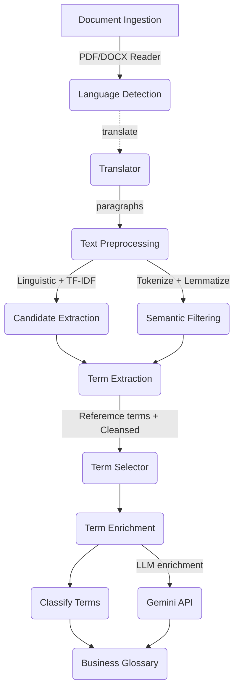

# 🧠 Business Glossary

A full-stack application for automatically **extracting, enriching, and managing business terms** from documents.  
The system uses NLP and semantic models to identify candidate terms, classify them into business domains, and enrich them with definitions and context — all stored in a central business glossary.

## 🚀 Overview

This project was developed as part of the **[VPBank Technology Hackathon 2025](https://www.vpbank.com.vn/tin-tuc/thong-cao-bao-chi/2025/khoi-dong-vpbank-technology-hackathon-2025-senior-track-co-hoi-gia-nhap-doi-ngu-cong-nghe-vpbank)**.

The topic is highly engaging — offering an opportunity to explore NLP and semantic intelligence for business knowledge extraction. This repository contains my end-to-end solution to tackle that challenge.

### 💡 Challenge Overview

> The organization has business terminology stored in documents(e.g BRDs, SRSs), but this information is static, fragmented and hard to access. As a result, teams face difficulties in understanding business procedures and definitions. The goal is to build an automatic tool that extracts and structures businerss terms from these documents into a centralized data dictionary, improving clarity and cross-team alignment.


### 🧩 Components
1. **Backend (Python FastAPI)**
   - Handles document parsing (`.docx`)
   - Extracts and cleans candidate business terms using:
     - Tokenization & Lemmatization
     - TF-IDF (statistical relevance)
     - Semantic Similarity (using Sentence Transformers)
   - Classifies terms into business domains
   - Enriches term definitions via Gemini API (due to rate limit, only 10 top terms are processed)
   - Persists results in MySQL database (`business_glossary`, `business_domain`)
   - Exposes REST APIs for front-end integration

2. **Frontend (React + Vite + TailwindCSS)**
   - Displays business domains and glossary terms from backend APIs


## 🧭 Application Flow



## ⚙️ Setup & Run

### Prerequisite

You'll need your own Gemini API key, and configured in `enrichment/gemini_enricher.py`

### Install libraries

```bash
# Install dependencies
pip install -r requirements.txt

# download model
python -m spacy download en_core_web_lg
```

### Run Backend

```bash
# Setup database with seed data
docker compose -f docker-compose.yml up -d

# Run FastAPI server
uvicorn main:app
```

Trigger document extraction pipeline
👉 [[Start document extraction](http://localhost:8000/api/process/)]

```bash
# Start document extraction
http://localhost:8000/api/process/
```

### Run Fontend
```bash
# Move into project directory
cd frontend

# Install dependencies
npm install

# Run frontend
npm run dev
```
Frontend runs at:
👉 http://localhost:5173

## 📎 Note

This project is created for learning and hackathon purposes. APIs such as `Gemini` may have rate limits — adjust batch size or delay between enrichment calls if you encounter quota issues.

You can easily extend this solution to support:

* Additional NLP models
* Document ingestion from multiple sources
* Integration with enterprise knowledge graphs

Happy hacking! 🚀